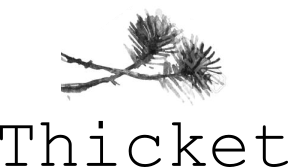

---


Parallel bootstrapping for Maximum-Likelihood (ML) phylogenies using Nextflow

[](https://www.nextflow.io/)


## Introduction

**Thicket** is a Nextflow wrapper around the popular ML phylogeny frameworks `RAxML-NG`, `PhyML` and `FastTree`. It parallelizes bootstrap computation (`Felsenstein`, `Transfer Bootstrap Expectation`, `Shimodaira-Hasegawa like local support values`) on any distributed system available through Nextflow using `conda` environments, cloud support for `AWS Batch` and soon `Google Cloud`, as well as containerization with `Singularity`.

The pipeline computes bootstrap replicates of an alignment using `golign` and can launch each replicate in a separate submission to job executors supported by Nextflow, such as the `local` system, `PBS/Torque` or `SGE`. If the input is a variant file in binary `Plink` format for diploid genomes, a concatenated alignment can be generated, with options to exclude invariant sites or translate heterozygous sites into ambiguous IUPAC DNA codes. Bootstraps are summarized onto a main phylogeny using methods selected from the tree constructors. User-defined option strings for the main phylogeny and bootstrap replicates expose all arguments of the command line interfaces from the ML software used in **Thicket**.

**Thicket** was built to facilitate large parallel computation of bootstrap values (> 100 cores) for high density genome array data from diploid organisms (canine genome, in this case) but can be used for any other data where computation of a large number of bootstrap replicate trees is computationally infeasible on systems with fewer cores or where tree estimation is time consuming.

## Pipeline steps

By default alignment input, the pipeline currently performs the following:

* Generates bootstrap replicates of the alignment (`Goalign`)
* Launches each bootstrap computation in the ML software (`RAxML-NG`, `PhyML 3` or `FastTree 2`)
* Launches computation of main phylogeny to map bootstrap values to (`RAxML-NG`, `PhyML 3` or `FastTree 2`)
* Summarizes bootstrap values onto the phylogeny (`RAxML-NG`, `PhyML 3` or `FastTree 2`)
* Provides summary of bootstrap statistics and distribution (`Gotree`)

If the input is a diploid genome and a variant file in binary PLINK format (`Plink`)

* Concatenate and optionally translate into ambiguous IUPAC codes to generate input alignment (`BioPython`) 

## Quick Start

1. Install [`nextflow`](docs/installation.md) and [`conda`](https://conda.io/miniconda.html)
2. Download the pipeline

```bash
nextflow pull esteinig/thicket
```

3. Set up your job with default parameters using `RAxML-NG`, model `GTRG+G` and default 100 bootstraps


```bash
nextflow run thicket -profile <local/pbs/sge/slurm> --alignment <align.fasta>
```

4. See the overview of the run by default in `thicket/`, bootstrapped 
tree in `thicket/thicket.tree` and bootstrap trees in `thicket/bootstraps.tree`

Modifications to the default pipeline are easily made using various options
as described in the documentation.

## Documentation

Thicket comes with documentation about the pipeline, found in the `docs/` directory:

1. [Installation](docs/installation.md)
2. Pipeline configuration
    * [Local installation](docs/configuration/local.md)
    * [Adding your own system](docs/configuration/adding_your_own.md)
3. [Running the pipeline](docs/usage.md)
4. [Output and how to interpret the results](docs/output.md)
5. [Troubleshooting](docs/troubleshooting.md)

This template will be used for `nf-core` release of Thicket. Uses Python libraries Click and Bioython. Dependencies distributed through BioConda.

## Dependencies


* **RAxML-NG** 
   * download: [https://anaconda.org/genomedk/raxml-ng/](https://anaconda.org/genomedk/raxml-ng)
   * cite: [https://doi.org/10.1101/447110/](https://doi.org/10.1101/447110)
* **PhyML** 
   * download: [https://anaconda.org/bioconda/phyml/](https://anaconda.org/bioconda/phyml)
   * cite: [https://www.ncbi.nlm.nih.gov/pubmed/20525638/](https://www.ncbi.nlm.nih.gov/pubmed/20525638)
* **FastTree** 
   * download: [https://anaconda.org/bioconda/fasttree/](https://anaconda.org/bioconda/fasttree)
   * cite: [https://www.ncbi.nlm.nih.gov/pmc/articles/PMC2835736/](https://www.ncbi.nlm.nih.gov/pmc/articles/PMC2835736/)
* **Goalign** 
   * download: [https://anaconda.org/bioconda/goalign/](https://anaconda.org/bioconda/goalign)
   * cite: [https://www.ncbi.nlm.nih.gov/pmc/articles/PMC6030568/](https://www.ncbi.nlm.nih.gov/pmc/articles/PMC6030568/)
* **Gotree**
   * download: [https://anaconda.org/bioconda/gotree/](https://anaconda.org/bioconda/gotree)
   * cite: [https://www.ncbi.nlm.nih.gov/pmc/articles/PMC6030568/](https://www.ncbi.nlm.nih.gov/pmc/articles/PMC6030568/)
* **BioPython** 
   * download: [https://pypi.org/project/biopython/](https://pypi.org/project/biopython/)
   * cite: [https://www.ncbi.nlm.nih.gov/pubmed/19304878/](https://www.ncbi.nlm.nih.gov/pubmed/19304878)
* **Click**
   * download: [https://pypi.org/project/click/](https://pypi.org/project/click/)
   * link: [https://palletsprojects.com/p/click/](https://palletsprojects.com/p/click/)
* **BioConda**:
   * channel: [https://bioconda.github.io/](https://bioconda.github.io/)
   * cite: [https://www.nature.com/articles/s41592-018-0046-7/](https://www.nature.com/articles/s41592-018-0046-7)
* **Nextflow**
   * download [https://anaconda.org/bioconda/nextflow/](https://anaconda.org/bioconda/nextflow)
   * cite: [https://www.ncbi.nlm.nih.gov/pubmed/28398311/](https://www.ncbi.nlm.nih.gov/pubmed/28398311)

## Credits

This pipeline was written by Eike Steinig ([esteinig](https://github.com/esteinig))
as part of an initiative to study dingo populations using high density genomic data
in collaboration with Kyall Zenger at James Cook University and Herman Raadsma at the
University of Sydney.


